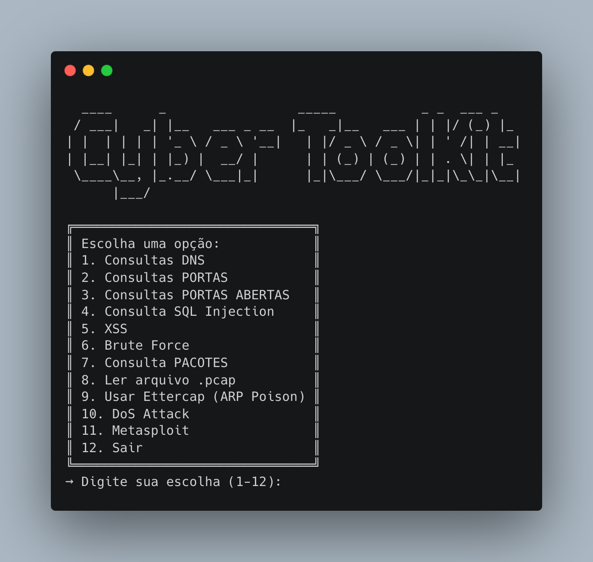

# CyberSentinel Toolkit

## Descrição Geral

Este projeto, é uma ferramenta de análise e teste de rede e segurança cibernética. Ele permite aos usuários executar uma variedade de operações, como captura de consultas DNS, varredura de portas, análise de injeção SQL, teste de Cross-Site Scripting (XSS), ataques de força bruta, leitura de arquivos pcap, simulação de ataques de rede, entre outros.

## Interface do Usuário



*A interface do usuário do CyberSentinel Toolkit, mostrando o menu principal.*

## Funcionalidades

- **Captura de Consultas DNS:** Captura e analisa consultas DNS na rede.
- **Varredura de Portas:** Realiza varredura de portas em um IP ou faixa de IPs.
- **Teste de Portas Abertas:** Testa portas abertas a partir de arquivos de varredura.
- **Análise de Injeção SQL:** Verifica vulnerabilidades de injeção SQL.
- **Teste XSS:** Realiza testes para vulnerabilidades de Cross-Site Scripting.
- **Ataque de Força Bruta:** Executa ataques de força bruta usando o Hydra.
- **Leitura de Pacotes:** Captura e analisa pacotes na rede usando tcpdump.
- **Leitura de Arquivos .pcap:** Permite a leitura e análise de arquivos .pcap.
- **ARP Poisoning com Ettercap:** Realiza ARP poisoning para interceptar o tráfego de rede.
- **Simulação de Ataque DoS:** Executa ataques de Denial of Service.
- **Pentest com Metasploit:** Realiza testes de penetração utilizando o Metasploit.

## Requisitos

- Python 3.x
- Bibliotecas Python: `netifaces`, `scapy` entre outras.
- Ferramentas: `Hydra`, `Ettercap`, `Metasploit`.

## Instalação

Clone o repositório e instale as dependências necessárias.

```bash
git clone https://github.com/RonierisonMaciel/CyberSentinel-Toolkit.git
```

```bash
cd CyberSentinel-Toolkit
```

```bash
pip install -r requirements.txt
```

## Uso

Para iniciar o programa, execute o script `main_script.py` no terminal.

```bash
python main_script.py
```

Siga as instruções no menu para escolher a operação desejada.

## Segurança e Advertências

Este software é destinado a fins educacionais e de teste em ambientes controlados. O uso indevido desta ferramenta para atividades maliciosas ou sem autorização é estritamente proibido.

## Contribuições

Contribuições para o projeto são bem-vindas. Por favor, siga as diretrizes de contribuição no repositório.

## Autor

Roni - Mestre em Ciência da Computação, pesquisador, professor e desenvolvedor de software.
